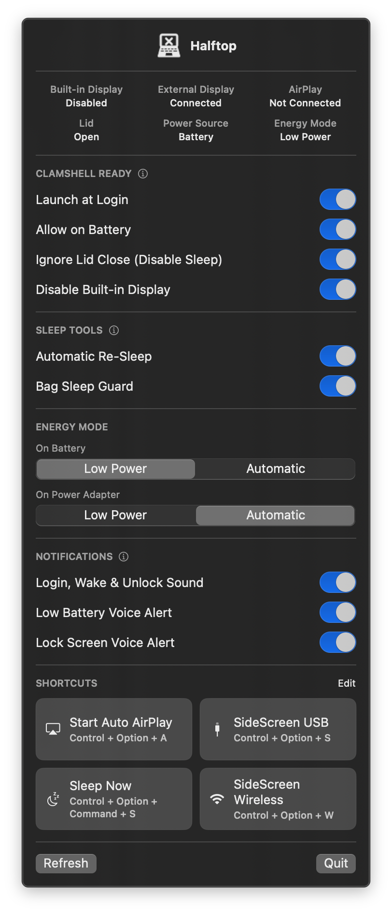

# Halftop

A menu-bar-only macOS utility that collects headless Mac workflows in one native SwiftUI app.

## Preview

<p align="center">
  
</p>

## Features

- Live 2×3 status overview for the built-in display, external monitor, AirPlay, lid, power source, and active Energy Mode
- Clamshell readiness based on physical external-display and power-adapter state
- Optional battery operation and experimental lid-close override
- Built-in display dimming and an explicit disable switch; dimming is hidden while the display is disabled
- Separate Automatic, Low Power, and supported High Power mode controls for battery and power-adapter use
- AirPlay display selection
- SideScreen USB and wireless launch actions
- Automatic re-sleep and bag-wake protection
- Low-battery and lock-screen voice alerts, plus a login, wake, and unlock sound
- App Intents for AirPlay and SideScreen actions
- URL actions: `halftop://airplay`, `halftop://sidescreen-usb`, and `halftop://sidescreen-wireless`

The app is an `LSUIElement` and does not appear in the Dock. Its menu icon is a template image that adapts to light and dark menu bars.

## Project layout

- `Sources/`: SwiftUI app, system monitoring, power management, App Intents, and the privileged lid helper
- `Tools/`: the only source copies of the scripts and helper tools launched or managed by the app
- `Assets/`: menu-bar artwork
- `script/build_and_run.sh`: build, bundle, sign, launch, and verify entry point

Enabled background tools install their runtime copies under:

```text
~/Library/Application Support/Halftop/Agents
```

Their source remains in this repository's `Tools/` directory.

## Build and run

Requirements: macOS 14+, Apple Silicon, and the Swift toolchain included with the installed Command Line Tools.

```zsh
./script/build_and_run.sh
./script/build_and_run.sh --verify
```

The staged application is written to `dist/Halftop.app` and ad-hoc signed.

## Shortcuts and keyboard shortcuts

The app exposes `Run Halftop Tool` through App Intents. Use the Shortcuts app to select the action and assign a keyboard shortcut from the shortcut's Details panel.

App Intents can provide actions and preconfigured App Shortcuts, but macOS keeps the actual keyboard combination as a user-owned Shortcuts preference. The app does not modify that preference programmatically.

Halftop also provides native global keyboard shortcuts that do not depend on the Shortcuts app:

- `Control + Option + A`: Start Auto AirPlay
- `Control + Option + S`: SideScreen USB
- `Control + Option + W`: SideScreen Wireless
- `Control + Option + Command + S`: Sleep Now

The `SHORTCUTS` section runs each action directly. Click `Edit` to record different combinations; changes are stored in the app's preferences. If an existing macOS service or Shortcuts workflow already owns a combination, the app shows a conflict and leaves that global shortcut inactive until a free combination is selected.

## Permissions

- AirPlay UI automation may require Accessibility and Automation access.
- SideScreen requires Screen & System Audio Recording access; its UI fallback may also require Accessibility.
- The experimental lid-close override and Energy Mode controls install a narrowly scoped privileged helper after administrator approval.

The normal Clamshell Ready path uses a temporary IOKit power assertion. Energy Mode changes use macOS power-management settings and are verified against the current system state. The lid-close override is not a supported public Apple API and changes a system-wide battery sleep setting.
